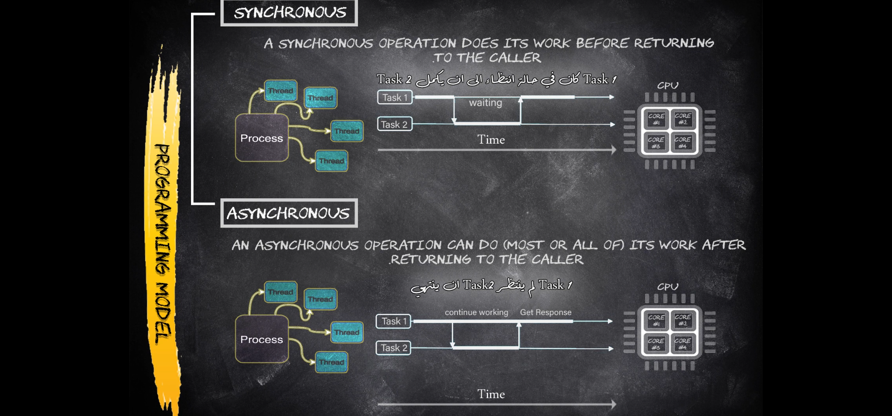

Understanding the difference between synchronous and asynchronous operations is fundamental in programming, especially in scenarios involving I/O-bound tasks, networking, and user interfaces. Let's break down the concepts and relate them to the visual representation provided.

### Synchronous Operations

**Definition:**
- A synchronous operation is one that runs in a sequential manner, completing its work before returning to the caller. This means the caller has to wait for the operation to finish before it can continue executing the subsequent code.

**Characteristics:**
- **Blocking:** The calling thread is blocked until the synchronous operation completes.
- **Sequential Execution:** Tasks are executed one after the other. The next task doesn't start until the current task finishes.
- **Easy to Understand:** The code execution flow is straightforward and predictable.

**Example in Code:**
```csharp
static void Main(string[] args)
{
    PerformTask1();
    PerformTask2();
}

static void PerformTask1()
{
    // Simulate a synchronous task
    Thread.Sleep(5000); // Blocking operation
    Console.WriteLine("Task 1 completed");
}

static void PerformTask2()
{
    Console.WriteLine("Task 2 completed");
}
```
In this example, `PerformTask2` will only run after `PerformTask1` finishes.

### Asynchronous Operations

**Definition:**
- An asynchronous operation allows the caller to continue executing subsequent code before the operation finishes. The operation completes its work in the background and notifies the caller when it is done.

**Characteristics:**
- **Non-blocking:** The calling thread is not blocked; it can continue executing other tasks while the asynchronous operation runs in the background.
- **Concurrent Execution:** Multiple tasks can run concurrently, improving performance, especially for I/O-bound or long-running operations.
- **More Complex:** Managing asynchronous operations can be more complex due to the need for handling callbacks, promises, or async/await patterns.

**Example in Code:**
```csharp
static async Task Main(string[] args)
{
    await PerformTask1Async();
    PerformTask2();
}

static async Task PerformTask1Async()
{
    // Simulate an asynchronous task
    await Task.Delay(5000); // Non-blocking operation
    Console.WriteLine("Task 1 completed");
}

static void PerformTask2()
{
    Console.WriteLine("Task 2 completed");
}
```
In this example, `PerformTask2` can run while `PerformTask1Async` is still awaiting the completion of the delay.

### Visual Representation Explanation

- 

#### Synchronous
- The diagram shows that Task 2 cannot start until Task 1 has completed.
- The CPU core handling the tasks is idle (waiting) while Task 1 is being executed.

#### Asynchronous
- Task 1 starts and can continue processing or return control to the caller almost immediately.
- Task 2 can start without waiting for Task 1 to complete.
- The CPU cores can handle other tasks while the asynchronous operations are pending, leading to better resource utilization and responsiveness.

### Key Points to Remember
- **Synchronous:** 
  - Simple, easy to follow.
  - Caller waits (blocks) for the operation to complete.
  - Suitable for quick, predictable tasks.

- **Asynchronous:** 
  - More efficient, especially for I/O-bound tasks.
  - Caller can continue executing other code.
  - Requires handling of asynchronous patterns (callbacks, promises, async/await).


## Example Code: Synchronous vs Asynchronous

Here is an example that demonstrates the differences between synchronous and asynchronous operations in terms of thread utilization and timing.

```csharp
namespace CA07SyncVsAsync
{
    internal class Program
    {
        static void Main(string[] args)
        {
            ShowThreadInfo(Thread.CurrentThread, 8);
            CallSyncMethod();

            ShowThreadInfo(Thread.CurrentThread, 11);
            CallAsyncMethod();

            ShowThreadInfo(Thread.CurrentThread, 14);

            Console.ReadKey();
        }

        static void CallSyncMethod()
        {
            Thread.Sleep(4000); // Blocking call
            ShowThreadInfo(Thread.CurrentThread, 20);
            Task.Run(() => { Console.WriteLine("++++++++++ Synchronous ++++++++++"); }).Wait();
        }

        static void CallAsyncMethod()
        {
            ShowThreadInfo(Thread.CurrentThread, 28);
            Task.Delay(4000).GetAwaiter().OnCompleted(() => { 
                ShowThreadInfo(Thread.CurrentThread, 30);
                Console.WriteLine("++++++++++ Asynchronous ++++++++++"); 
            });
        }

        static void ShowThreadInfo(Thread th, int lineNumber)
        {
            Console.WriteLine($"\nLine#: {lineNumber}, ThID: {th.ManagedThreadId}, ThName: {th.Name}, " +
                $"Pooled: {th.IsThreadPoolThread}, BackGround: {th.IsBackground}");   
        }
    }
}
```

### Explanation

#### `Main` Method
- **Lines 8-14**: The `Main` method calls `ShowThreadInfo` three times to display information about the main thread at different points in the execution. It first calls `CallSyncMethod` and then `CallAsyncMethod`.

#### `CallSyncMethod`
- **Line 18**: `Thread.Sleep(4000)` blocks the calling thread (main thread) for 4 seconds.
- **Line 20**: After the sleep, it shows the thread info.
- **Line 21**: A task is run synchronously using `Task.Run(...).Wait()`, which again blocks the main thread until the task completes.
- **Line 22**: Outputs "++++++++++ Synchronous ++++++++++" indicating the completion of the synchronous method.

#### `CallAsyncMethod`
- **Line 27**: Shows the thread info before the asynchronous operation.
- **Line 28**: `Task.Delay(4000)` returns a task that completes after 4 seconds without blocking the calling thread.
- **Line 29-31**: `GetAwaiter().OnCompleted(...)` schedules a callback that runs on the completion of the delay, printing "++++++++++ Asynchronous ++++++++++" and showing the thread info at that point. Note that this callback will likely run on a different thread than the main thread.

#### `ShowThreadInfo`
- This method displays information about the current thread, including:
  - **ManagedThreadId**: Unique identifier for the thread.
  - **Name**: The name of the thread.
  - **IsThreadPoolThread**: Indicates if the thread is a thread pool thread.
  - **IsBackground**: Indicates if the thread is a background thread.

### Output and Thread Utilization

- **Synchronous Method**:
  - The main thread is blocked for the duration of the `Thread.Sleep` and the `Task.Run(...).Wait()`.
  - All operations are performed on the main thread.

- **Asynchronous Method**:
  - The main thread is not blocked by `Task.Delay`. Instead, it continues to the next line, allowing other work to proceed.
  - The callback for `OnCompleted` may run on a different thread from the thread pool, showing asynchronous execution.

### Conclusion

Understanding the differences between synchronous and asynchronous programming allows you to write more efficient and responsive applications. Use synchronous operations when simplicity and predictability are needed. Use asynchronous operations to improve performance and responsiveness, especially when dealing with I/O-bound or long-running operations.