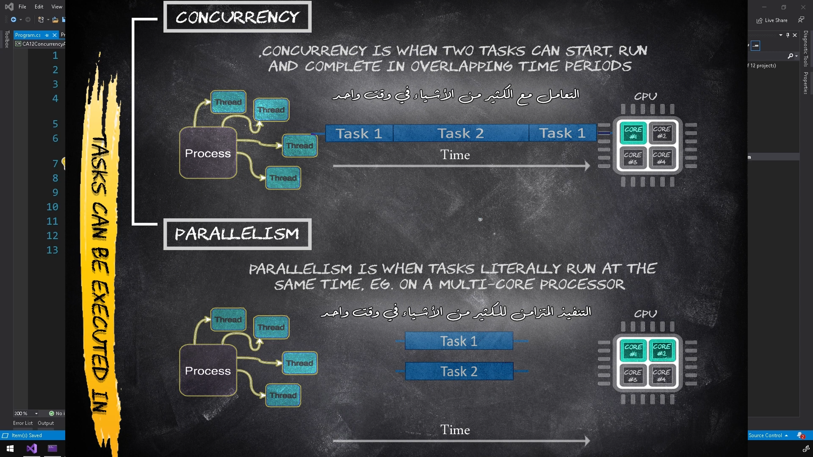

# Concurrency and Parallelism


## Introduction

Concurrency and Parallelism are fundamental concepts in computer science, particularly when dealing with multitasking and performance optimization. They allow multiple tasks to be executed in overlapping periods or simultaneously, improving the efficiency and responsiveness of applications.

## Concurrency

### Definition

Concurrency is when two or more tasks can start, run, and complete in overlapping time periods. It doesn't mean the tasks are running at the same instant but rather that they can be in progress simultaneously.

### Characteristics

- **Time-Slicing:** Tasks may share the same processor (CPU), with the processor switching between tasks to give the appearance of simultaneous execution.
- **Single-Core Execution:** Concurrency can occur on a single-core CPU through context switching, where the CPU rapidly switches between tasks.
- **Threads:** Multiple threads are often used to achieve concurrency. Each thread represents a separate task.

### Real-World Example

Imagine you are typing a document while listening to music. You are doing both activities concurrently. Your attention (like the CPU) switches between typing and listening, but you are not doing both at the exact same moment.

### Code Example

Below is an example of concurrency using C#'s `async` and `await` keywords:

```csharp
using System;
using System.Threading;
using System.Threading.Tasks;

class ConcurrencyExample
{
    static async Task Main(string[] args)
    {
        Task task1 = Task.Run(() => DoWork("Task 1"));
        Task task2 = Task.Run(() => DoWork("Task 2"));

        await Task.WhenAll(task1, task2);
    }

    static void DoWork(string taskName)
    {
        for (int i = 0; i < 5; i++)
        {
            Console.WriteLine($"{taskName} is running.");
            Thread.Sleep(1000); // Simulate work
        }
    }
}
```

In this example, `Task.Run` is used to execute `DoWork` methods concurrently.

## Parallelism

### Definition

Parallelism is when tasks literally run at the same time, for example, on a multi-core processor. This means that multiple tasks are being executed simultaneously.

### Characteristics

- **Simultaneous Execution:** Tasks are executed simultaneously on multiple CPU cores.
- **Multi-Core Processing:** Parallelism requires a multi-core processor where each core can handle a separate task.
- **Efficiency:** Parallelism can significantly speed up processing time by dividing a task into sub-tasks that are executed concurrently.

### Real-World Example

Imagine you have a team of people assembling a car. Each person (like a CPU core) is working on a different part of the car at the same time. This is parallelism, where multiple parts of the task are being executed simultaneously.

### Code Example

Below is an example of parallelism using C#'s `Parallel` class:

```csharp
using System;
using System.Threading.Tasks;

class ParallelismExample
{
    static void Main(string[] args)
    {
        Parallel.Invoke(
            () => DoWork("Task 1"),
            () => DoWork("Task 2")
        );
    }

    static void DoWork(string taskName)
    {
        for (int i = 0; i < 5; i++)
        {
            Console.WriteLine($"{taskName} is running.");
            Task.Delay(1000).Wait(); // Simulate work
        }
    }
}
```

In this example, `Parallel.Invoke` is used to execute `DoWork` methods in parallel.

## Key Differences

- **Concurrency:** Tasks may not run at the same instant but can be in progress simultaneously. It relies on the system's ability to manage multiple tasks through context switching.
- **Parallelism:** Tasks run simultaneously on different processors or cores. It is a subset of concurrency where tasks truly execute at the same time.

## Example

Below is a more detailed example demonstrating both concurrency and parallelism.

```csharp
namespace CA12ConcurrencyAndParallelism
{
    internal class Program
    {
        static async Task Main(string[] args)
        {
            var dailyDuties = new List<DailyDuty>
            {
                new DailyDuty("Wake up"),
                new DailyDuty("Brush teeth"),
                new DailyDuty("Take a shower"),
                new DailyDuty("Eat breakfast"),
                new DailyDuty("Go to work"),
                new DailyDuty("Work"),
                new DailyDuty("Eat lunch"),
                new DailyDuty("Work"),
                new DailyDuty("Go home"),
                new DailyDuty("Eat dinner"),
                new DailyDuty("Watch TV"),
                new DailyDuty("Go to bed")
            };

            Console.WriteLine("Processing things in parallel");
            Console.WriteLine("-------------------------------");
            await ProcessThingsInParallel(dailyDuties);

            Console.WriteLine("\nProcessing things in concurrent");
            Console.WriteLine("-------------------------------");
            await ProcessThingsInConcurrent(dailyDuties);

            Console.WriteLine("\nAll tasks completed");
            Console.ReadKey();
        }

        static Task ProcessThingsInParallel(IEnumerable<DailyDuty> dailyDuties)
        {
            Parallel.ForEach(dailyDuties, dailyDuty =>
            {
                dailyDuty.Process();
            });

            return Task.CompletedTask;
        }

        static Task ProcessThingsInConcurrent(IEnumerable<DailyDuty> dailyDuties)
        {
            foreach (var dailyDuty in dailyDuties)
            {
                dailyDuty.Process();
            }

            return Task.CompletedTask;
        }
    }

    class DailyDuty
    {
        public string Title { get; private set; }
        public bool Processed { get; private set; }

        public DailyDuty(string title)
        {
            Title = title;
            Processed = false;
        }

        public void Process()
        {
            Console.WriteLine($"TID: {Thread.CurrentThread.ManagedThreadId}, ProcessorID: {Thread.GetCurrentProcessorId()}");
            Task.Delay(200).Wait();
            Processed = true;
        }
    }
}
```

### Explanation

- **Parallel Processing (`ProcessThingsInParallel` method):** All tasks are processed at the same time using different threads. You will notice in the output that tasks are being processed simultaneously, indicating true parallelism.
- **Concurrent Processing (`ProcessThingsInConcurrent` method):** Tasks are processed one by one in the same thread. In the output, you will see that tasks are processed sequentially, demonstrating concurrency.

## Example with Cancellation Mechanism

In real-world applications, it is often necessary to be able to cancel ongoing operations. Below is an improved example demonstrating how to incorporate cancellation into both concurrency and parallelism.

```csharp
using System;
using System.Collections.Generic;
using System.Linq;
using System.Threading;
using System.Threading.Tasks;

namespace CA12ConcurrencyAndParallelism
{
    internal class Program
    {
        static async Task Main(string[] args)
        {
            var dailyDuties = new List<DailyDuty>
            {
                new DailyDuty("Wake up"),
                new DailyDuty("Brush teeth"),
                new DailyDuty("Take a shower"),
                new DailyDuty("Eat breakfast"),
                new DailyDuty("Go to work"),
                new DailyDuty("Work"),
                new DailyDuty("Eat lunch"),
                new DailyDuty("Work"),
                new DailyDuty("Go home"),
                new DailyDuty("Eat dinner"),
                new DailyDuty("Watch TV"),
                new DailyDuty("Go to bed")
            };

            var cts = new CancellationTokenSource();

            // Task to listen for the cancellation signal
            var cancellationTask = Task.Run(() =>
            {
                if (Console.ReadKey().Key == ConsoleKey.Q)
                {
                    cts.Cancel();
                }
            });

            // Concurrency Example
            Console.WriteLine("Processing duties concurrently...");
            try
            {
                await ProcessThingsConcurrently(dailyDuties, cts.Token);
            }
            catch (OperationCanceledException)
            {
                Console.WriteLine("Concurrent processing was canceled.");
            }
            catch (Exception ex)
            {
                Console.WriteLine($"Exception: {ex.Message}");
            }

            Console.WriteLine("==================");

            // Parallelism Example
            Console.WriteLine("Processing duties in parallel...");
            try
            {
                await ProcessThingsInParallel(dailyDuties, cts.Token);
            }
            catch (OperationCanceledException)
            {
                Console.WriteLine("Parallel processing was canceled.");
            }
            catch (Exception ex)
            {
                Console.WriteLine($"Exception: {ex.Message}");
            }

            Console.WriteLine("==================");

            // Await cancellation task
            await cancellationTask;

            if (dailyDuties.All(d => d.Processed))
            {
                Console.WriteLine("All daily duties have been processed.");
            }
            else
            {
                Console.WriteLine("Some daily duties have not been processed.");
            }

            Console.ReadKey();
        }

        static async Task ProcessThingsConcurrently(IEnumerable<DailyDuty> dailyDuties, CancellationToken token)
        {
            foreach (var dailyDuty in dailyDuties)
            {
                token.ThrowIfCancellationRequested();
                await Task.Run(() => dailyDuty.Process(), token);
            }
        }

        static Task ProcessThingsInParallel(IEnumerable<DailyDuty> dailyDuties, CancellationToken token)
        {
            return Task.Run(() =>
            {
                Parallel.ForEach(dailyDuties, new ParallelOptions { CancellationToken = token }, dailyDuty =>
                {
                    token.ThrowIfCancellationRequested();
                    dailyDuty.Process();
                });
            }, token);
        }
    }

    class DailyDuty
    {
        public string Title { get; private set; }
        public bool Processed { get; private set; }

        public DailyDuty(string title)
        {
            Title = title;
            Processed = false;
        }

        public void Process()
        {
            Console.WriteLine($"Processing '{Title}' on TID: {Thread.CurrentThread.ManagedThreadId}, ProcessorID: {Thread.GetCurrentProcessorId()}");
            Task.Delay(1000).Wait(); // Simulate work
            Processed = true;
        }
    }
}
```

### Explanation

In the example above, a `CancellationTokenSource` is used to allow the cancellation of tasks. The `cancellationTask` listens for the `Q` key press to trigger the cancellation. Both the concurrent and parallel processing methods check for cancellation requests using `token.ThrowIfCancellationRequested()`. If cancellation is requested, an `OperationCanceledException` is thrown, and the process stops gracefully.

## Key Differences

- **Concurrency:** Tasks may not run at the same instant but can be in progress simultaneously. It relies on the system's ability to manage multiple tasks through context switching.
- **Parallelism:** Tasks run simultaneously on different processors or cores. It is a subset of concurrency where tasks truly execute at the same time.

## Summary

- **Concurrency** allows multiple tasks to progress at overlapping times through context switching. It is useful for improving responsiveness.
- **Parallelism** executes multiple tasks at the same time on different cores, improving throughput and performance.

Understanding these concepts helps in designing efficient and responsive applications, especially when dealing with long-running or compute-intensive tasks.
