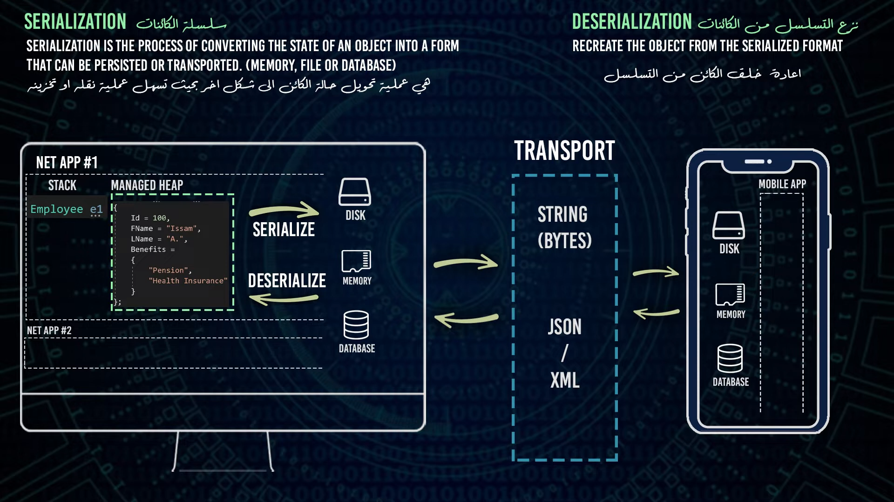

### Serialization in .NET

- 
- 

#### What is Serialization and Why?
Serialization => (التسلسل) 
Deserialization => (الغاء التسلسل)

**Serialization** is the process of converting an object into a format that can be easily stored or transmitted and later reconstructed. In .NET, serialization is used to transform objects into a stream of bytes (binary serialization) or a textual format like XML or JSON, enabling the storage of object data in files, databases, or across network protocols.

**Why use Serialization?**
- **Persistence:** Save the state of an object to a file or database.
- **Communication:** Send object data over a network.
- **Caching:** Store objects in memory or on disk for quick retrieval.
- **Cloning:** Create a deep copy of an object.
- **Configuration:** Transfer complex objects as part of configuration settings.

### What is XML and JSON?

**XML (eXtensible Markup Language):**
- A markup language that defines a set of rules for encoding documents in a format that is both human-readable and machine-readable.
- Uses tags to define the structure of the data.
- Often used for data interchange and storage in web services and applications.
- Example:
  ```xml
  <Person>
    <Name>John Doe</Name>
    <Age>30</Age>
  </Person>
  ```

**JSON (JavaScript Object Notation):**
- A lightweight data interchange format that is easy for humans to read and write and easy for machines to parse and generate.
- Uses a key-value pair structure, with data enclosed in curly braces `{}`.
- Commonly used in web APIs and modern web applications.
- Example:
  ```json
  {
    "Name": "John Doe",
    "Age": 30
  }
  ```

### Binary Serialization

**Binary Serialization** in .NET converts an object into a binary format, which is a compact and efficient way to store or transmit the object. This type of serialization is used when performance and size are critical concerns.

**Key Features:**
- Efficient in terms of storage space and speed.
- Not human-readable.
- Compatible with .NET's runtime serialization.

**Example using `BinaryFormatter`:**
```csharp
using System;
using System.IO;
using System.Runtime.Serialization.Formatters.Binary;

[Serializable]
public class Person
{
    public string Name { get; set; }
    public int Age { get; set; }
}

class Program
{
    static void Main()
    {
        Person person = new Person { Name = "John Doe", Age = 30 };

        // Serialize
        BinaryFormatter formatter = new BinaryFormatter();
        using (FileStream stream = new FileStream("person.bin", FileMode.Create))
        {
            formatter.Serialize(stream, person);
        }

        // Deserialize
        using (FileStream stream = new FileStream("person.bin", FileMode.Open))
        {
            Person deserializedPerson = (Person)formatter.Deserialize(stream);
            Console.WriteLine($"{deserializedPerson.Name}, {deserializedPerson.Age}");
        }
    }
}
```
> Note: `BinaryFormatter` is now considered insecure for untrusted data. Alternative serialization methods (like `DataContractSerializer` or `JsonSerializer`) are recommended for secure and cross-platform compatibility.

### DataContractSerializer

**DataContractSerializer** is a more secure and flexible serialization method provided by .NET. It is often used for serializing objects to XML but can also be used for other formats.

**Example using `DataContractSerializer`:**
```csharp
using System;
using System.IO;
using System.Runtime.Serialization;
using System.Xml;

[DataContract]
public class Person
{
    [DataMember]
    public string Name { get; set; }

    [DataMember]
    public int Age { get; set; }
}

class Program
{
    static void Main()
    {
        Person person = new Person { Name = "John Doe", Age = 30 };

        // Serialize
        DataContractSerializer serializer = new DataContractSerializer(typeof(Person));
        using (FileStream stream = new FileStream("person.xml", FileMode.Create))
        {
            using (XmlWriter writer = XmlWriter.Create(stream))
            {
                serializer.WriteObject(writer, person);
            }
        }

        // Deserialize
        using (FileStream stream = new FileStream("person.xml", FileMode.Open))
        {
            Person deserializedPerson = (Person)serializer.ReadObject(stream);
            Console.WriteLine($"{deserializedPerson.Name}, {deserializedPerson.Age}");
        }
    }
}
```

### System.Text.Json (JsonSerializer)

**JsonSerializer** from the `System.Text.Json` namespace is a modern, high-performance JSON library in .NET, offering robust security and ease of use.

**Example using `JsonSerializer`:**
```csharp
using System;
using System.IO;
using System.Text.Json;

public class Person
{
    public string Name { get; set; }
    public int Age { get; set; }
}

class Program
{
    static void Main()
    {
        Person person = new Person { Name = "John Doe", Age = 30 };

        // Serialize
        string jsonString = JsonSerializer.Serialize(person);
        File.WriteAllText("person.json", jsonString);

        // Deserialize
        string jsonFromFile = File.ReadAllText("person.json");
        Person deserializedPerson = JsonSerializer.Deserialize<Person>(jsonFromFile);
        Console.WriteLine($"{deserializedPerson.Name}, {deserializedPerson.Age}");
    }
}
```

### Why Use `DataContractSerializer` and `JsonSerializer`?

- **Security:** Both serializers are designed with modern security practices in mind, making them safer for handling untrusted data.
- **Flexibility:** `DataContractSerializer` supports XML, which is widely used in legacy systems and web services. `JsonSerializer` is ideal for web applications and services due to the widespread adoption of JSON.
- **Performance:** `JsonSerializer` is optimized for high performance, especially in web environments.
- **Interoperability:** Both serializers offer better cross-platform support compared to `BinaryFormatter`.

These alternatives provide secure and efficient ways to serialize and deserialize objects, making them suitable for various application scenarios, from web services to data storage.

### XML Serialization

**XML Serialization** converts an object into an XML format. This is useful for interoperability with systems that consume or produce XML, such as web services.

**Key Features:**
- Human-readable and editable.
- Schema validation is possible.
- Interoperable with various platforms.

**Example using `XmlSerializer`:**
```csharp
using System;
using System.IO;
using System.Xml.Serialization;

public class Person
{
    public string Name { get; set; }
    public int Age { get; set; }
}

class Program
{
    static void Main()
    {
        Person person = new Person { Name = "John Doe", Age = 30 };

        // Serialize
        XmlSerializer serializer = new XmlSerializer(typeof(Person));
        using (FileStream stream = new FileStream("person.xml", FileMode.Create))
        {
            serializer.Serialize(stream, person);
        }

        // Deserialize
        using (FileStream stream = new FileStream("person.xml", FileMode.Open))
        {
            Person deserializedPerson = (Person)serializer.Deserialize(stream);
            Console.WriteLine($"{deserializedPerson.Name}, {deserializedPerson.Age}");
        }
    }
}
```

### JSON Serialization

**JSON Serialization** converts an object into a JSON format. This format is widely used in web development, especially in RESTful APIs.

**Key Features:**
- Lightweight and easy to read/write.
- Native support in many programming languages.
- Ideal for web applications.

**Example using `JsonSerializer`:**
```csharp
using System;
using System.IO;
using System.Text.Json;

public class Person
{
    public string Name { get; set; }
    public int Age { get; set; }
}

class Program
{
    static void Main()
    {
        Person person = new Person { Name = "John Doe", Age = 30 };

        // Serialize
        string jsonString = JsonSerializer.Serialize(person);
        File.WriteAllText("person.json", jsonString);

        // Deserialize
        string jsonFromFile = File.ReadAllText("person.json");
        Person deserializedPerson = JsonSerializer.Deserialize<Person>(jsonFromFile);
        Console.WriteLine($"{deserializedPerson.Name}, {deserializedPerson.Age}");
    }
}
```

### JSON and HttpClient

When working with web APIs, `HttpClient` is commonly used in .NET to send and receive HTTP requests and responses. JSON is often used as the data format for these requests and responses.

**Example of using `HttpClient` with JSON:**
```csharp
using System;
using System.Net.Http;
using System.Text;
using System.Text.Json;
using System.Threading.Tasks;

public class Person
{
    public string Name { get; set; }
    public int Age { get; set; }
}

class Program
{
    static async Task Main(string[] args)
    {
        HttpClient client = new HttpClient();
        Person person = new Person { Name = "John Doe", Age = 30 };

        // Serialize Person to JSON and send a POST request
        string jsonString = JsonSerializer.Serialize(person);
        StringContent content = new StringContent(jsonString, Encoding.UTF8, "application/json");
        HttpResponseMessage response = await client.PostAsync("https://api.example.com/person", content);

        if (response.IsSuccessStatusCode)
        {
            string responseJson = await response.Content.ReadAsStringAsync();
            Person responsePerson = JsonSerializer.Deserialize<Person>(responseJson);
            Console.WriteLine($"{responsePerson.Name}, {responsePerson.Age}");
        }
    }
}
```
This example demonstrates how to serialize an object to JSON, send it in a POST request using `HttpClient`, and then deserialize the response back into an object.