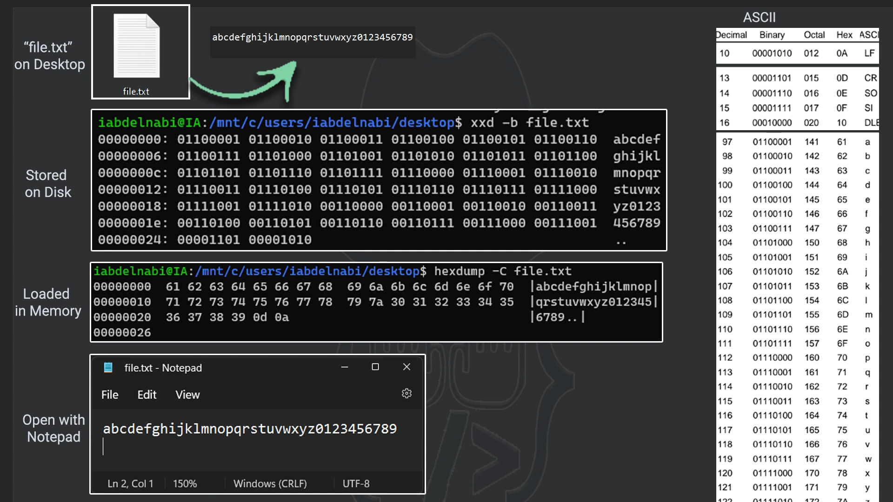

# Strings in C# - Deep Dive
- 
## Table of Contents
- [Introduction](#introduction)
- [L01. ASCII](#l01-ascii)
- [L02. Encoding and Unicode](#l02-encoding-and-unicode)
- [L03. Instantiation](#l03-instantiation)
- [L04. Unicode and String Comparison](#l04-unicode-and-string-comparison)
- [L05. Intern Pool](#l05-intern-pool)
- [L06. String Methods](#l06-string-methods)

## Introduction
Strings in C# are powerful and versatile. This deep dive covers various aspects of strings, including ASCII representation, encoding, different ways to instantiate strings, Unicode and string comparison, string interning, and a variety of string methods.

## L01. ASCII
This lesson demonstrates how to iterate over the ASCII character set and display its different representations.

```csharp
using System;

namespace Mah_Mattar
{
    internal class Program
    {  
        static void Main(string[] args)
        {
            for (byte c = 0; c < 255; ++c)
            {
                char ch = (char)c;
                string dec = c.ToString().PadLeft(3, '0');
                string hex = c.ToString("X");
                string binary = Convert.ToString(c, 2).PadLeft(8, '0');
                Console.WriteLine($"{dec,-12} {binary,-12} {hex,-12} {ch,-12}");
            }

            Console.ReadKey();
        }
    }
}
```

## L02. Encoding and Unicode
This lesson introduces encoding and Unicode by downloading content from a web URL and saving it using different encodings (ASCII and UTF-8). It also shows how to register and use different encoding providers, such as GB18030 for Chinese characters.

```csharp
using System;
using System.IO;
using System.Net.Http;
using System.Text;
using System.Threading.Tasks;

namespace Mah_Mattar
{
    internal class Program
    {
        static void Main(string[] args)
        {
            Encoding.RegisterProvider(CodePagesEncodingProvider.Instance);
            Encoding chinese = Encoding.GetEncoding("GB18030");
            Console.WriteLine("大");

            Task.Run(() => GetDataUTF8Format());
            Console.ReadKey();
        }

        static async Task GetDataAssciFormat()
        {
            var path = $"{Environment.GetFolderPath(Environment.SpecialFolder.Desktop)}";
            var filePath = $"{path}\\asciiNewsContent.txt";

            using (var client = new HttpClient())
            {
                Uri uri = new Uri("https://aljazeera.net/search/feed");
                using (HttpResponseMessage response = await client.GetAsync(uri))
                {
                    var byteArray = await response.Content.ReadAsByteArrayAsync();
                    string result = Encoding.ASCII.GetString(byteArray);
                    File.WriteAllText(filePath, result);
                }
            }
        }

        static async Task GetDataUTF8Format()
        {
            var path = $"{Environment.GetFolderPath(Environment.SpecialFolder.Desktop)}";
            var filePath = $"{path}\\utf8NewsContent.txt";

            using (var client = new HttpClient())
            {
                Uri uri = new Uri("https://aljazeera.net/search/feed");
                using (HttpResponseMessage response = await client.GetAsync(uri))
                {
                    var byteArray = await response.Content.ReadAsByteArrayAsync();
                    string result = Encoding.UTF8.GetString(byteArray);
                    File.WriteAllText(filePath, result);
                }
            }
        }
    }
}
```

## L03. Instantiation
Different ways to instantiate strings in C# are demonstrated.

### Using Quoted String Literals
```csharp
private static void UsingQuotedStringLiterals()
{
    string str = "Mahmoud";
    Console.WriteLine(str);
}
```

### Using String Constructor
```csharp
private static void UsingStringConstructor()
{
    char[] letters = { 'M', 'a', 'h', 'm', 'o', 'u', 'd' };
    string str = new string(letters);
    Console.WriteLine(str);
}
```

### Using Repeating Character
```csharp
private static void UsingRepeatingCharacter()
{
    string str = new string('M', 8);
    Console.WriteLine(str);
}
```

### Using Pointer to Signed Byte
```csharp
private static void UsingPointerToSignedByte()
{
    sbyte[] bytes = { 0x4D, 0x65, 0x74, 0x69, 0x67, 0x61, 0x74, 0x6F, 0x72 };
    string str = null;
    unsafe
    {
        fixed (sbyte* ptr = bytes)
        {
            str = new string(ptr);
            Console.WriteLine(str);
        }
    }
}
```

### Using a Pointer to Character Array
```csharp
private static void UsingAPointerToCharacterArray()
{
    char[] letters = { 'M', 'a', 'h', 'm', 'o', 'u', 'd' };
    string str = null;
    unsafe
    {
        fixed (char* pchars = letters)
        {
            str = new string(pchars);
            Console.WriteLine(str);
        }
    }
}
```

### Using Concatenation
```csharp
private static void UsingConcatenation()
{
    string str1 = "Mah" + "Moud";
    string str2 = $"{"Mah"}{"Moud"}"; // string interpolation

    Console.WriteLine($"str1 = {str1}");
    Console.WriteLine($"str2 = {str2}");
}
```

### Using Method That Returns String
```csharp
private static void UsingCallingMethodThatReturnsString()
{
    string sentence = "I Love Metigator channel.";
    int startPos = sentence.IndexOf("Metigator"); // 7
    string str = sentence.Substring(startPos, 9); // string from 7
    Console.WriteLine(str);
}
```

### Using Formatted String
```csharp
private static void UsingFormattedString()
{
    string customer = "Mahmoud Mattar";
    DateTime shippingDate = DateTime.Now;
    DateTime expectedDelivery = shippingDate.AddDays(7);
    decimal shippingCost = 29.99m;

    string str = String.Format(
        "\nDear {0},\n\nAt {1:t} on {1:D}, the order is on its way to you\nIt's expected to be delivered at {2:t} on {2:D}, the order is on its way to you\nShipping cost {3:c}.\n\t\t\tThanks for shopping with us!",
        customer, shippingDate, expectedDelivery, shippingCost);
    Console.WriteLine(str);
}
```

### Using Verbatim with String Interpolation
```csharp
private static void UsingVerbatimWithStringInterpolation()
{
    string customer = "Mahmoud Mattar";
    DateTime shippingDate = DateTime.Now;
    DateTime expectedDelivery = shippingDate.AddDays(7);
    decimal shippingCost = 29.99m;

    string str = $@"Dear {customer},

At {shippingDate:t} on {shippingDate:D}, the order is on its way to you
It's expected to be delivered at {expectedDelivery:t} on {expectedDelivery:D}, the order is on its way to you
Shipping cost {shippingCost:c}.
                        Thanks for shopping with us!";
    Console.WriteLine(str);
}
```

### Using Raw String
```csharp
private static void UsingRawString()
{
    string str = """
                <nav class="box">
                    <ul>
                        <a href="javascript:void(0)">"Home"</a>
                    <li>
                    <ul>
                        <a href="javascript:void(0)">About us</a>
                    <li>
                </nav>
            """;

    string str2 = """ this is a single line raw string""";
    Console.WriteLine(str);
    Console.WriteLine(str2);
}
```

## L04. Unicode and String Comparison
This lesson covers how to handle Unicode characters and compare strings with different representations.

```csharp
using System;
using System.IO;

namespace Mah_Mattar
{
    internal class Program
    {
        static void Main(string[] args)
        {
            StreamWriter sw = new StreamWriter(@".\output.txt");
            string char1 = "\u0061"; // a
            string char2 = "\u0308"; // ̈

            sw.WriteLine(char1); // a
            sw.WriteLine(char2); // ̈

            string grapheme = "\u0061\u0308";
            sw.WriteLine(grapheme); // ä

            string singleChar = "\u00e4";
            sw.WriteLine(singleChar); // ä

            // representation are equal
            sw.WriteLine("{0} = {1} (Culture-sensitive): {2}", grapheme, singleChar,
                         String.Equals(grapheme, singleChar,
                                       StringComparison.CurrentCulture)); // true

            sw.WriteLine("{0} = {1} (Ordinal): {2}", grapheme, singleChar,
                         String.Equals(grapheme, singleChar,
                                       StringComparison.Ordinal)); // False

            sw.WriteLine("{0} = {1} (Normalized Ordinal): {2}", grapheme, singleChar,
                         String.Equals(grapheme.Normalize(),
                                       singleChar.Normalize(),
                                       StringComparison.Ordinal)); // True
            sw.Close();
        }
    }
}
```

## L05. Intern Pool


This lesson demonstrates the concept of the string intern pool and how strings are stored and retrieved.

```csharp
using System;

namespace Mah_Mattar
{
    internal class Program
    {
        static void Main(string[] args)
        {
            string str1 = "MyTest";
            string str2 = "My" + "Test";
            Console.WriteLine(object.ReferenceEquals(str1, str2)); // True

            string str3 = "My" + "Test";
            Console.WriteLine(object.ReferenceEquals(str1, str3)); // True

            string str4 = "Hello World";
            string str5 = string.Intern(str4);
            Console.WriteLine(object.ReferenceEquals(str4, str5)); // True
        }
    }
}
```

## L06. String Methods
This lesson covers various string methods, including comparison, searching, and splitting.

```csharp
using System;

namespace Mah_Mattar
{
    internal class Program
    {
        static void Main(string[] args)
        {
            string sentence = "The quick brown fox jumps over the lazy dog.";

            // Contains
            Console.WriteLine(sentence.Contains("fox")); // True

            // IndexOf
            Console.WriteLine(sentence.IndexOf("fox")); // 16

            // Replace
            string newSentence = sentence.Replace("fox", "cat");
            Console.WriteLine(newSentence); // The quick brown cat jumps over the lazy dog.

            // Split
            string[] words = sentence.Split(' ');
            foreach (string word in words)
            {
                Console.WriteLine(word);
            }

            // Substring
            string substring = sentence.Substring(16, 3);
            Console.WriteLine(substring); // fox
        }
    }
}
```
