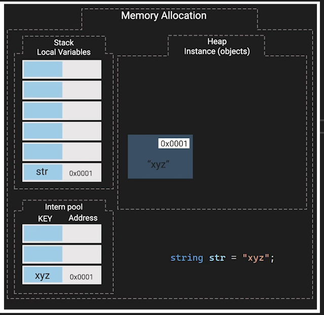

The intern pool, also known as the string intern pool, is a mechanism used in .NET (and Java) to optimize memory usage and improve performance when dealing with strings. It ensures that identical string literals are stored only once in memory. Here’s a deep dive into the concept and mechanism:
# Intern Pool

- 

### What is the Intern Pool?
- **Definition**: The intern pool is a table maintained by the runtime (CLR in .NET, JVM in Java) that stores unique string literals. When a string literal is created, the runtime checks the intern pool to see if an identical string already exists.
- **Purpose**: This mechanism is used to save memory by avoiding the creation of multiple instances of identical strings. Instead of allocating new memory for every identical string literal, the runtime reuses the existing instance from the intern pool.

### How It Works in .NET
1. **String Literal Creation**:
    - When a string literal is declared in the code (e.g., `string str = "xyz";`), the runtime checks the intern pool to see if the string "xyz" already exists.
2. **Checking the Intern Pool**:
    - If the string "xyz" exists in the intern pool, the reference to this string is returned, and no new memory is allocated.
    - If the string "xyz" does not exist, it is added to the intern pool, and the reference to this new string is returned.
3. **Memory Allocation**:
    - In the intern pool, each unique string literal is stored only once, with its reference being reused wherever the same literal appears in the code.
    - The stack holds the reference to the string in the intern pool rather than duplicating the string data.

### Example Explained
In the image provided:
- The code `string str = "xyz";` is executed.
- The intern pool already contains the string "xyz" at address `0x0001`.
- The variable `str` in the stack local variables section holds the reference `0x0001`, pointing to the string "xyz" in the intern pool.

### Benefits of String Interning
- **Memory Efficiency**: By storing only one instance of each unique string literal, memory usage is significantly reduced.
- **Performance**: Comparing string references is faster than comparing string values, leading to performance improvements in operations involving string comparison.

### String Interning in .NET
- **Manual Interning**: You can manually intern strings using the `String.Intern` method in .NET. This method checks if the string is in the intern pool, and if not, adds it.
  ```csharp
  string str1 = "xyz";
  string str2 = String.Intern(new String(new char[] {'x', 'y', 'z'}));
  bool areSame = Object.ReferenceEquals(str1, str2); // True
  ```

### Limitations and Considerations
- **Garbage Collection**: Interned strings are not garbage collected until the runtime itself unloads, meaning they can contribute to memory usage over the lifetime of the application.
- **Appropriate Usage**: Overusing string interning can lead to increased memory consumption, so it should be used judiciously, especially for large or dynamically generated strings.

Understanding the intern pool and the string interning mechanism helps in writing memory-efficient and performant applications, especially when dealing with a large number of string operations.
