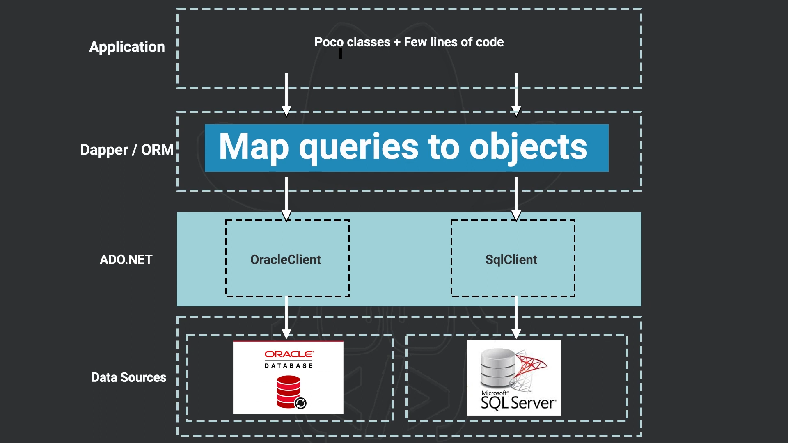

# Dapper ORM: A Comprehensive Guide

## clarification
1. **P1**
   - 

## Introduction

Dapper is a lightweight and fast Object-Relational Mapper (ORM) for .NET, designed to provide a simple and efficient way to work with databases. It sits on top of ADO.NET and offers a convenient API for performing CRUD (Create, Read, Update, Delete) operations and executing queries. Dapper is known for its performance and ease of use, making it a popular choice among .NET developers.

## Why Use Dapper?

- **Performance**: Dapper is known for its high performance. It is often faster than other ORMs like Entity Framework because it minimizes abstraction and uses raw SQL queries.
- **Simplicity**: Dapper is simple to use and integrates seamlessly with existing ADO.NET code.
- **Flexibility**: It allows you to write raw SQL queries, giving you complete control over your database interactions.
- **Minimal Configuration**: Dapper requires minimal configuration and setup.

## Getting Started with Dapper

### Installing Dapper

To install Dapper, you can use the NuGet Package Manager Console or the .NET CLI:

```sh
# Using NuGet Package Manager Console
Install-Package Dapper

# Using .NET CLI
dotnet add package Dapper
```

### Setting Up the Database Connection

First, you need to set up a connection to your database. Here’s how you can do it using `SqlConnection`:

```csharp
using System.Data.SqlClient;
using Dapper;

public class DatabaseConnection
{
    private readonly string _connectionString;

    public DatabaseConnection(string connectionString)
    {
        _connectionString = connectionString;
    }

    public SqlConnection GetConnection()
    {
        return new SqlConnection(_connectionString);
    }
}
```

## CRUD Operations with Dapper

### Create (Insert)

```csharp
using System.Data;
using Dapper;

public class Wallet
{
    public int Id { get; set; }
    public string Holder { get; set; }
    public decimal Balance { get; set; }
}

public void InsertWallet(Wallet wallet)
{
    using (var connection = new SqlConnection("YourConnectionString"))
    {
        string sql = "INSERT INTO Wallets (Holder, Balance) VALUES (@Holder, @Balance);";
        connection.Execute(sql, wallet);
    }
}
```

### Read (Select)

```csharp
using System.Data;
using Dapper;

public class Wallet
{
    public int Id { get; set; }
    public string Holder { get; set; }
    public decimal Balance { get; set; }
}

public Wallet GetWalletById(int id)
{
    using (var connection = new SqlConnection("YourConnectionString"))
    {
        string sql = "SELECT * FROM Wallets WHERE Id = @Id;";
        return connection.QuerySingleOrDefault<Wallet>(sql, new { Id = id });
    }
}

public IEnumerable<Wallet> GetAllWallets()
{
    using (var connection = new SqlConnection("YourConnectionString"))
    {
        string sql = "SELECT * FROM Wallets;";
        return connection.Query<Wallet>(sql).ToList();
    }
}
```

### Update

```csharp
using System.Data;
using Dapper;

public class Wallet
{
    public int Id { get; set; }
    public string Holder { get; set; }
    public decimal Balance { get; set; }
}

public void UpdateWallet(Wallet wallet)
{
    using (var connection = new SqlConnection("YourConnectionString"))
    {
        string sql = "UPDATE Wallets SET Holder = @Holder, Balance = @Balance WHERE Id = @Id;";
        connection.Execute(sql, wallet);
    }
}
```

### Delete

```csharp
using System.Data;
using Dapper;

public class Wallet
{
    public int Id { get; set; }
    public string Holder { get; set; }
    public decimal Balance { get; set; }
}

public void DeleteWallet(int id)
{
    using (var connection = new SqlConnection("YourConnectionString"))
    {
        string sql = "DELETE FROM Wallets WHERE Id = @Id;";
        connection.Execute(sql, new { Id = id });
    }
}
```

## Advanced Queries

### Multiple Results

Dapper allows you to handle multiple result sets from a single query using the `QueryMultiple` method.

```csharp
using System.Data;
using Dapper;

public class Wallet
{
    public int Id { get; set; }
    public string Holder { get; set; }
    public decimal Balance { get; set; }
}

public class WalletRepository
{
    private readonly string _connectionString;

    public WalletRepository(string connectionString)
    {
        _connectionString = connectionString;
    }

    public (IEnumerable<Wallet> Wallets, int TotalCount) GetWalletsAndCount()
    {
        using (var connection = new SqlConnection(_connectionString))
        {
            string sql = @"SELECT * FROM Wallets;
                           SELECT COUNT(*) FROM Wallets;";

            using (var multi = connection.QueryMultiple(sql))
            {
                var wallets = multi.Read<Wallet>().ToList();
                var totalCount = multi.Read<int>().Single();
                return (wallets, totalCount);
            }
        }
    }
}
```

### Stored Procedures

Dapper supports executing stored procedures by setting the command type to `CommandType.StoredProcedure`.

```csharp
using System.Data;
using Dapper;

public class Wallet
{
    public int Id { get; set; }
    public string Holder { get; set; }
    public decimal Balance { get; set; }
}

public class WalletRepository
{
    private readonly string _connectionString;

    public WalletRepository(string connectionString)
    {
        _connectionString = connectionString;
    }

    public Wallet GetWalletById(int id)
    {
        using (var connection = new SqlConnection(_connectionString))
        {
            string sql = "GetWalletById"; // Name of the stored procedure
            return connection.QuerySingleOrDefault<Wallet>(sql, new { Id = id }, commandType: CommandType.StoredProcedure);
        }
    }
}
```

## Transactions

### Using Transactions with Dapper

Dapper supports transactions to ensure the atomicity of a series of operations. This means that all operations within a transaction either complete successfully or all are rolled back.

#### Example: Performing a Transaction

Here’s an example of using transactions in Dapper:

```csharp
using System.Data;
using Dapper;
using Microsoft.Data.SqlClient;
using Microsoft.Extensions.Configuration;

public class Wallet
{
    public int Id { get; set; }
    public string Holder { get; set; }
    public decimal Balance { get; set; }
}

public class WalletRepository
{
    private readonly string _connectionString;

    public WalletRepository(string connectionString)
    {
        _connectionString = connectionString;
    }

    public void TransferFunds(int fromWalletId, int toWalletId, decimal amount)
    {
        using (var connection = new SqlConnection(_connectionString))
        {
            connection.Open();
            using (var transaction = connection.BeginTransaction())
            {
                try
                {
                    string sqlDebit = "UPDATE Wallets SET Balance = Balance - @Amount WHERE Id = @Id;";
                    connection.Execute(sqlDebit, new { Amount = amount, Id = fromWalletId }, transaction: transaction);

                    string sqlCredit = "UPDATE Wallets SET Balance = Balance + @Amount WHERE Id = @Id;";
                    connection.Execute(sqlCredit, new { Amount = amount, Id = toWalletId }, transaction: transaction);

                    transaction.Commit();
                    Console.WriteLine("Transaction Completed Successfully");
                }
                catch (Exception ex)
                {
                    transaction.Rollback();
                    Console.WriteLine("Transaction Failed: " + ex.Message);
                    // Log the exception or handle it as needed
                }
                finally
                {
                    connection.Close();
                }
            }
        }
    }
}
```

### Explanation of Key Points

1. **Open Database Connection**:
   ```csharp
   connection.Open();
   ```
   - Opens a connection to the database.

2. **Begin Transaction**:
   ```csharp
   using (var transaction = connection.BeginTransaction())
   ```
   - Begins a new transaction on the open connection.

3. **Execute Commands within Transaction**:
   ```csharp
   connection.Execute(sqlDebit, new { Amount = amount, Id = fromWalletId }, transaction: transaction);
   connection.Execute(sqlCredit, new { Amount = amount, Id = toWalletId }, transaction: transaction);
   ```
   - Executes SQL commands within the context of the transaction.

4. **Commit Transaction**:
   ```csharp
   transaction.Commit();
   ```
   - Commits the transaction if all commands execute successfully.

5. **Rollback Transaction**:
   ```csharp
   catch (Exception ex)
   {
       transaction.Rollback();
       Console.WriteLine("Transaction Failed: " + ex.Message);
   }
   ```
   - Rolls back the transaction in case of an error, ensuring no partial changes are made to the database.

### Best Practices for Transactions

- **Keep Transactions Short**: Transactions should be as short as possible to reduce the risk of locking resources and improve performance.
- **Handle Exceptions**: Always handle exceptions and roll back transactions in case of errors to maintain data integrity.
- **Use Connection Pools**: Ensure that your application uses connection pooling to manage database connections efficiently.
- **Avoid Nested Transactions**: Nested transactions can be complex and error-prone. Avoid them when possible.

## Use Cases in Real-World Scenarios

### Microservices

Dapper is ideal for microservices architectures due to its lightweight nature and performance efficiency. Each microservice can use Dapper to interact with its own database, ensuring high performance and quick response times.

### High-Performance Applications

In applications where performance is critical, such as

 real-time financial systems or gaming platforms, Dapper's minimal overhead and direct use of raw SQL make it an excellent choice.

### Legacy Systems Integration

Dapper can be easily integrated into legacy systems that already use ADO.NET, allowing you to leverage its benefits without a complete system overhaul.

## Conclusion

Dapper is a powerful and efficient ORM for .NET that provides a simple way to perform CRUD operations, execute queries, and manage transactions. Its performance and ease of use make it a popular choice for developers building high-performance applications. By following best practices and understanding its features, you can leverage Dapper to build robust and scalable applications.

---
 Dapper's simplicity and performance make it an excellent choice for a wide range of applications. Happy coding!