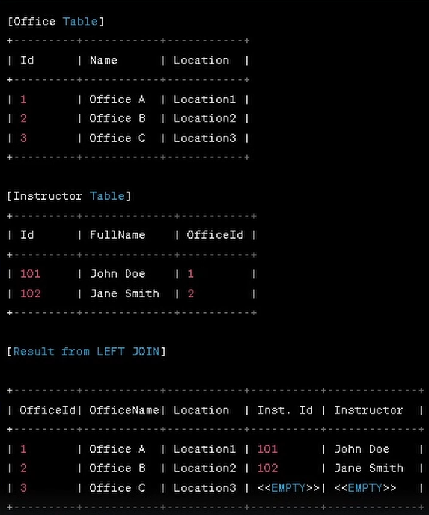

### Understanding `LeftJoin` in Entity Framework Core

#### What is a Left Join?

A **Left Join** (also known as a **Left Outer Join**) is a type of join that returns all the rows from the **left table** (the first table in the join clause) and the matched rows from the **right table** (the second table). If there is no match, the result is `NULL` for columns from the right table. This allows you to retrieve all the data from the left table, regardless of whether there is related data in the right table.

#### Purpose of Left Join

The primary purpose of a Left Join is to include all records from the left table and only the matching records from the right table. It's commonly used when you want to keep all the data from the left table even if there is no corresponding data in the right table. This is useful when dealing with optional relationships, where not every entry in the left table has a corresponding entry in the right table.

### Example Scenario

Let's use your sample tables: `Course`, `Section`, and `Review`.

#### Example Tables:

- **Course**: This table holds information about different courses.
- **Section**: This table holds different sections for each course.
- **Review**: This table holds reviews for courses.

Suppose you want to retrieve a list of all courses along with their sections. If a course doesn’t have any sections, you still want to display the course name.

### Example 1: Using Query Syntax

```csharp
// Query syntax
var resultQuerySyntax = (from c in context.Courses.AsNoTracking()
                         join s in context.Sections.AsNoTracking()
                             on c.Id equals s.CourseId into courseSections
                         from cs in courseSections.DefaultIfEmpty()
                         select new
                         {
                             CourseName = c.CourseName,
                             SectionName = cs != null ? cs.SectionName : "No Sections",
                             DateRange = cs != null ? cs.DateRange.ToString() : "N/A",
                             TimeSlot = cs != null ? cs.TimeSlot.ToString() : "N/A"
                         }).ToList();
```

### Explanation of Query Syntax:

1. **`join s in context.Sections.AsNoTracking() on c.Id equals s.CourseId into courseSections`:**
   - This performs the join between `Courses` and `Sections` based on `CourseId`.
   - `into courseSections` groups the results into a collection named `courseSections`.

2. **`from cs in courseSections.DefaultIfEmpty()`:**
   - This ensures that if there are no matching sections, `cs` will be `null`.

3. **`select new { ... }`:**
   - Here, we create an anonymous object. If `cs` is not `null`, we display the section details. Otherwise, we display placeholder text such as "No Sections" or "N/A".

### Example 2: Using Method Syntax

```csharp
// Method syntax
var resultMethodSyntax = context.Courses.AsNoTracking()
    .GroupJoin(context.Sections.AsNoTracking(),
        c => c.Id,
        s => s.CourseId,
        (c, courseSections) => new { c, courseSections })
    .SelectMany(
        x => x.courseSections.DefaultIfEmpty(),
        (x, cs) => new
        {
            CourseName = x.c.CourseName,
            SectionName = cs != null ? cs.SectionName : "No Sections",
            DateRange = cs != null ? cs.DateRange.ToString() : "N/A",
            TimeSlot = cs != null ? cs.TimeSlot.ToString() : "N/A"
        }).ToList();
```

### Explanation of Method Syntax:

1. **`GroupJoin`:**
   - This method performs the same function as the `join ... into` in query syntax. It groups the matching `Sections` with each `Course`.

2. **`SelectMany`:**
   - This flattens the results, similar to the `from cs in courseSections.DefaultIfEmpty()` in query syntax.
   - `DefaultIfEmpty()` ensures that if there are no matches, it still returns a result with `null` values for the `Section` fields.

### When to Use Left Join

Use a **Left Join** when you need to include all records from the left table, even if there are no related records in the right table. This is particularly useful in reporting, where you need to show all items (like courses) even if they don’t have related data (like sections).

### Key Points to Remember:

- **Left Join** returns all rows from the left table and the matched rows from the right table.
- If no match is found, columns from the right table will be `NULL`.
- It’s useful when you want to preserve all records from the left table.

### Summary

The **Left Join** is a powerful tool when you need to retrieve data from two tables but want to ensure that all records from the first table are included in your result, even if there are no corresponding matches in the second table. Understanding when and how to use Left Join can help you retrieve the necessary data while preserving the integrity of your primary dataset.


### another Example:



Let's break down the example shown in the image to explain the concept of a **Left Join**.

#### Tables Involved:

1. **Office Table:**
   - Contains information about different offices.
   - Columns: `Id`, `Name`, `Location`.

2. **Instructor Table:**
   - Contains information about instructors.
   - Columns: `Id`, `FullName`, `OfficeId`.

#### Example Data:

- **Office Table:**
  - `Office A` is in `Location1`.
  - `Office B` is in `Location2`.
  - `Office C` is in `Location3`.

- **Instructor Table:**
  - `John Doe` is associated with `Office A` (`OfficeId = 1`).
  - `Jane Smith` is associated with `Office B` (`OfficeId = 2`).
  - There is no instructor associated with `Office C` (`OfficeId = 3`).

#### Result from Left Join:

The **Left Join** combines records from both tables, showing all rows from the left table (`Office`) and matched rows from the right table (`Instructor`). If there is no match, the result shows `NULL` or `<<EMPTY>>` for the columns from the right table.

##### Resulting Table:

| OfficeId | OfficeName | Location  | Instructor Id | Instructor Name |
|----------|------------|-----------|---------------|-----------------|
| 1        | Office A   | Location1 | 101           | John Doe        |
| 2        | Office B   | Location2 | 102           | Jane Smith      |
| 3        | Office C   | Location3 | <<EMPTY>>     | <<EMPTY>>       |

#### Explanation of the Left Join:

1. **Office A and B:**
   - Both `Office A` and `Office B` have corresponding instructors (`John Doe` and `Jane Smith`).
   - The `Left Join` combines data from both tables where there is a match on `OfficeId`.

2. **Office C:**
   - `Office C` does not have a corresponding instructor in the `Instructor` table.
   - The `Left Join` still includes `Office C` in the results, but the columns related to the `Instructor` table are filled with `NULL` or `<<EMPTY>>` (as shown in the example).

#### Summary:

- **Left Join** is used to include all records from the left table (`Office`), even when there are no matching records in the right table (`Instructor`).
- This allows you to see which offices do not have assigned instructors and includes them in the results.

This example visually demonstrates the key purpose of the **Left Join**: to ensure that all records from the left table appear in the result, regardless of whether they have matching records in the right table.